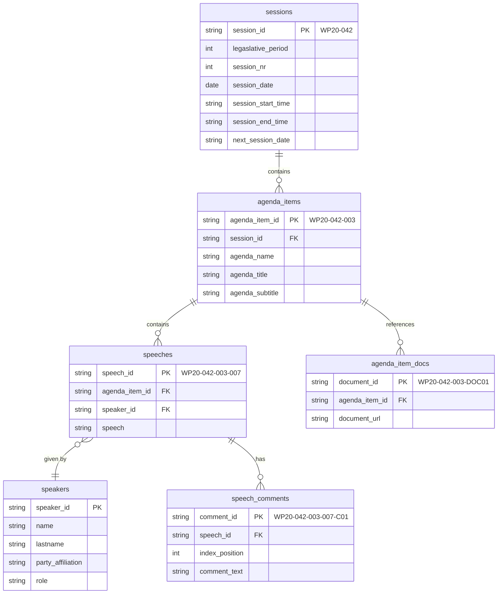

# 🏛️ Bundestag Speeches Pipeline

**A modern data engineering pipeline that extracts, transforms, and models plenary speech data from the German Bundestag — built on Databricks, Delta Lake, and dbt.**

> 🚧 **Active Development** — Silver layer nearly complete · 854 speeches across 6 sessions loaded · 31/32 dbt tests passing
>
> 📍 The [`feature/databricks_migration`](https://github.com/YOUR_USERNAME/Bundestag_Speeches/tree/feature/databricks_migration) branch reflects the current state of the project. The `main` branch is intentionally empty and will be updated upon completion of the silver layer.

---

## What & Why

**Situation** — The German Bundestag publishes all plenary debate transcripts as structured XML files. These protocols contain rich, hierarchical data: sessions → agenda items → individual speeches, including speaker metadata, party affiliations, interjections, and referenced legislative documents. It's one of the most complete open parliamentary datasets in Europe.

**Complication** — While several academic projects have parsed this data (notably [Open Discourse](https://open-discourse.de/), [GermaParl](https://github.com/PolMine/GermaParl), and [SpeakGer](https://github.com/Norface-EUINACTION/SpeakGer)), they typically focus on the NLP and political science layer. None offer a reproducible, cloud-native data engineering pipeline that follows modern practices like the medallion architecture, incremental loading, schema enforcement, and automated testing — the kind of stack you'd find in a production analytics team.

**Solution** — This project builds that pipeline end-to-end: from raw XML ingestion through validated bronze tables, through a fully tested and documented dbt transformation layer, toward a serving layer that powers an interactive frontend for exploring parliamentary debates.

**Context** — This is also a learning project. It's my first end-to-end data engineering build as part of an Ironhack Data Engineering bootcamp. The goal is not just to solve a data problem, but to practice making real engineering decisions — choosing natural keys over surrogates, deciding when *not* to add Docker, writing tests before building downstream models — and documenting the reasoning behind them.

---

## Pipeline Architecture

The pipeline follows a **medallion architecture** (bronze → silver → gold) running on Databricks with Unity Catalog.

<p align="center">
  
</p>

| Layer | Status |
|-------|--------|
| **Bronze** — XML fetch, validation, extraction, cleaning, schema enforcement, Delta write | ✅ Complete |
| **Silver Staging** — 22-column Delta table with `ARRAY<STRUCT>` for comments, CHECK constraints | ✅ Complete |
| **Silver dbt** — 8 models, 31/32 tests passing, full column documentation | 🟡 Near-complete (1 known bug) |
| **Gold** — Aggregated analytical views | 🔲 Planned |
| **Serving** — Flask API + frontend | 🔲 Planned |

---

## Data Model

The silver layer produces six normalized tables connected by hierarchical string keys.



**Key format:** `WP{legislative_period}-{session_nr}-{agenda_item_nr}-{speech_position}` — human-readable, hierarchical, and self-documenting. Each segment uses 3-digit zero-padding (e.g. `WP20-042-003-007`). The `legislative_period` is kept as a natural integer key (no padding) since it's a small, meaningful number.

---

## Tech Stack

| Component | Technology |
|-----------|------------|
| **Cloud Platform** | Databricks (Community → Workspace) |
| **Storage** | Delta Lake on Unity Catalog |
| **Transformation** | dbt Core 1.11.6 + dbt-databricks |
| **Ingestion** | Python (requests, xml.etree, pandas, pandera) |
| **Schema Validation** | Pandera (bronze), dbt tests (silver) |
| **Compute** | Databricks SQL Warehouse |
| **Version Control** | Git + GitHub |
| **Local Dev** | VS Code + Databricks Connect |

---

## Project Structure

```
Bundestag_Speeches/
├── ingestion/                    # Bronze layer — Python extraction pipeline
│   ├── xml_fetcher.py            #   Download & validate XML from Bundestag API
│   ├── session_extraction.py     #   Parse XML into structured DataFrames
│   ├── cleaning.py               #   Text normalization, type casting
│   ├── schemas_bronze.py         #   Pandera + PySpark schema definitions
│   ├── register_session_ingestion.py  # Idempotent session registry
│   ├── save_speeches.py          #   Parquet export utility
│   └── ingestion_orchestration_test.py # End-to-end ingestion test
│
├── infrastructure/               # Databricks DDL scripts
│   ├── 01_create_catalog.sql     #   Unity Catalog setup
│   ├── 02_create_schemas.sql     #   bronze / silver_staging / silver / gold
│   ├── 03_create_volumes.sql     #   Raw XML storage volume
│   └── 04_create_tables.sql      #   Delta tables with CHECK constraints
│
├── bundestag_dbt/                # Silver layer — dbt transformation
│   ├── dbt_project.yml
│   ├── macros/
│   │   └── generate_schema_name.sql  # Schema routing override
│   └── models/
│       ├── staging/
│       │   ├── stg_bundestag__speeches.sql      # Source interface (view)
│       │   ├── int_bundestag__speeches.sql      # Key construction logic (view)
│       │   ├── _src_bundestag.yml               # Source definition
│       │   └── _stg_bundestag_speeches.yml      # 22-column documentation + tests
│       └── silver/
│           ├── sessions.sql          # Distinct sessions
│           ├── agenda_items.sql      # Distinct agenda items
│           ├── agenda_item_docs.sql  # Exploded document URLs (POSEXPLODE)
│           ├── speakers.sql          # Distinct speakers
│           ├── speeches.sql          # Individual speeches
│           ├── speech_comments.sql   # Exploded interjections (POSEXPLODE)
│           └── _silver_schema.yml    # PK/FK tests, relationship tests, docs
│
├── exploration/                  # Initial data exploration
│   └── first_exploration.ipynb
│
├── load/                         # Placeholder — Delta write utilities
├── transformation/               # Placeholder — pre-dbt transformations
└── docs/                         # Documentation assets
    └── bundestag_pipeline_architecture.svg
```

---

## What's Been Built

### Bronze Layer — XML Ingestion Pipeline

The ingestion layer handles the full journey from raw XML to a validated Delta table:

1. **Fetch** (`xml_fetcher.py`) — Downloads plenary protocol XML files from the Bundestag's open data API. Validates the root element structure before saving. Dependency injection allows swapping the output directory (local vs. Databricks Volume).

2. **Registry** (`register_session_ingestion.py`) — Before processing, each session is registered in a `raw_sessions` Delta table. A `DuplicateIngestionError` guard prevents re-ingesting already-processed files, making the pipeline idempotent.

3. **Extraction** (`session_extraction.py`) — Parses hierarchical XML into flat rows at the speech grain. Each speech carries its session context, agenda item context, speaker metadata, the full speech text, and an array of interjection dictionaries with character-level index positions (enabling future reconstruction of the original transcript with interjections inline).

4. **Cleaning & Validation** (`cleaning.py`, `schemas_bronze.py`) — Normalizes Unicode whitespace, casts types (dates, integers), and validates the full DataFrame against a Pandera schema with column-level constraints (nullability, min string lengths, type checks). A parallel PySpark schema definition enforces the same structure on write to Delta.

5. **Delta Write** — The validated DataFrame is written to `bundestag_dev.silver_staging.speeches_staging`, a 22-column Delta table with CHECK constraints (legislative period > 0, name length ≥ 2, etc.) and audit columns (`processed_at`, `updated_at`, `source_path`).

**Current scale:** 854 speeches across 6 plenary sessions loaded and validated.

### Silver Layer — dbt Transformation

The silver layer uses dbt Core to transform the flat staging table into a normalized, tested, and documented set of analytical tables. The DAG follows a flat fan-out pattern: one staging view → one intermediate view → six silver tables, all built in parallel from the intermediate model.

**Key design: hierarchical string keys** — The intermediate model (`int_bundestag__speeches`) is the heart of the transformation. It constructs human-readable composite keys by:
- Grouping speeches by agenda-item attributes to identify distinct agenda items
- Using `MIN(speech_id)` as a proxy for chronological order (since agenda items have no explicit ordering in the source XML)
- Assigning `ROW_NUMBER()` within each session to create sequential agenda item positions
- Building keys like `WP20-042-003-007` through string concatenation with `LPAD` zero-padding

**EXPLODE models** — Two silver models use `POSEXPLODE` to unpack complex array columns:
- `agenda_item_docs` — Explodes `ARRAY<STRING>` of document URLs into one row per document
- `speech_comments` — Explodes `ARRAY<STRUCT<index_position, comment_text>>` into one row per interjection, with character-level position tracking

**Testing & documentation:**
- 31 of 32 dbt tests passing (not_null, unique, relationships across all PK/FK pairs)
- Full column-level documentation for all 22 staging columns and all silver table columns
- Relationship tests validate referential integrity across all foreign key links

### Known Shortcomings

**Speaker extraction bug (1 failing test)** — The XML parser currently takes the first `<redner>` (speaker) element found anywhere within a `<rede>` (speech) element. When a speech contains nested interjections that are themselves `<rede>` elements (a quirk of the Bundestag XML schema), the parser can pick up the interjecting speaker's metadata instead of the main speaker's. The fix is identified: restrict the XPath to only the first direct-child `<redner>` within each `<rede>`. This is a bronze-layer extraction fix that will propagate through the pipeline.

**Limited scale** — Currently only 6 sessions are loaded. The pipeline works but has not been tested at full scale (~250 sessions per legislative period). Scaling is a near-term priority.

**No orchestration yet** — The ingestion steps are currently run manually via Databricks notebooks. Automated scheduling (Databricks Workflows as a first step, Apache Airflow as a future option) is planned.

---

## Key Design Decisions

| Decision | Reasoning |
|----------|-----------|
| **Natural keys over surrogates** | The Bundestag provides stable, meaningful identifiers. Hierarchical string keys (`WP20-042-003-007`) are self-documenting, debuggable, and encode the entity hierarchy directly. No surrogate key mapping needed. |
| **Flat modeling over star schema** | With 854 rows and 6 entities, the data doesn't warrant the complexity of a full dimensional model. Flat normalized tables are simpler to test, easier to reason about, and sufficient for the current analytical needs. |
| **dbt Core over dbt Fusion** | Evaluated dbt Fusion but found the Databricks adapter too immature (manifest incompatibility, no perceptible benefit at this scale). dbt Core 1.11.6 with dbt-databricks is stable and well-documented. |
| **No Docker / Terraform** | Premature complexity. The infrastructure is a single Databricks workspace with Unity Catalog. Adding containerization and IaC would add overhead without meaningful benefit at this stage. Will revisit when the pipeline needs to be deployed to a shared environment. |
| **`IS NOT DISTINCT FROM` for joins** | Agenda-level fields (`agenda_title`, `agenda_subtitle`, `agenda_docs`) are nullable. Standard `=` comparisons fail on NULLs. Using `IS NOT DISTINCT FROM` provides NULL-safe equality, preventing silent row drops in the intermediate model's key construction join. |
| **`POSEXPLODE` over `LATERAL VIEW`** | Databricks supports `POSEXPLODE` natively, which returns both the array index and value in a single function call. This cleanly feeds the hierarchical document and comment IDs without needing a separate ROW_NUMBER. |
| **Views for staging + intermediate** | The staging model and intermediate model are materialized as views to avoid physically duplicating the 854-row source table. Only the six silver output tables are materialized as Delta tables. |
| **`generate_schema_name` macro override** | Default dbt behavior prepends the target schema to custom schema names (e.g. `silver_staging_silver`). The override ensures models land in the exact Unity Catalog schema specified (e.g. `silver`). |

---

## Roadmap

### Immediate (next steps)
- [ ] Fix speaker extraction bug (restrict XPath to first direct-child `<redner>`)
- [ ] Add schema + tests for `agenda_item_docs` and `speech_comments` models *(partially done)*
- [ ] Scale ingestion beyond 6 sessions → full WP20 (~250 sessions)
- [ ] Set up Databricks Workflows for automated pipeline runs (Phase 1 orchestration)

### Short-term
- [ ] Build gold layer with aggregated analytical views
- [ ] Implement Apache Airflow orchestration (Phase 2)
- [ ] Add document URL auto-fetcher (download referenced PDFs)
- [ ] Build Flask serving API

### Long-term vision
- [ ] Interactive frontend ("BundestagExplorer") for searching, filtering, and analyzing speeches
- [ ] Claude-powered conversational interface for querying parliamentary data
- [ ] NLP enrichment layer (topic modeling, sentiment analysis)

---

## Frontend Vision

The long-term goal is an interactive web application ("BundestagExplorer") for exploring Bundestag speeches — with search and filtering, speech detail views with inline interjections, a session timeline, and an analytics dashboard.

> **Note:** The frontend is not yet implemented. Current project focus is on completing the data engineering pipeline.

---

## Acknowledgments

This project builds on the German Bundestag's [Open Data initiative](https://www.bundestag.de/services/opendata), which provides machine-readable plenary protocols. Prior work by [Open Discourse](https://open-discourse.de/), [GermaParl](https://github.com/PolMine/GermaParl), and [SpeakGer](https://github.com/Norface-EUINACTION/SpeakGer) informed the data understanding. The differentiation of this project lies in the modern cloud-native engineering stack, not in the parsing layer.

---

<sub>Built as a portfolio project during the Ironhack Data Engineering Bootcamp (2026). Questions or feedback welcome via GitHub Issues.</sub>
